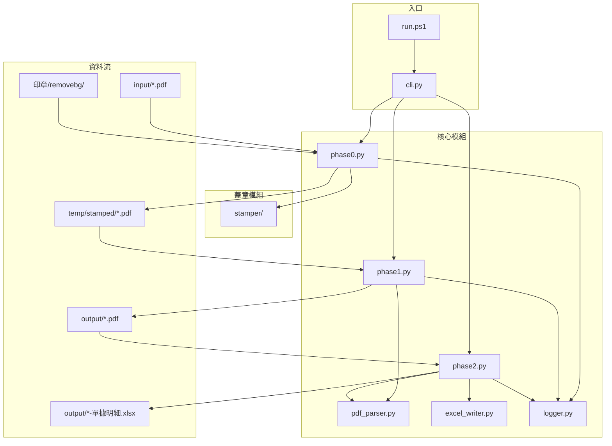

# CLAUDE.md

This file provides guidance to Claude Code (claude.ai/code) when working with code in this repository.

## 專案概述

PDF 採購單據批次重組與 Excel 明細產生器。將當天所有 PDF 單據自動蓋章、依採購單號分組合併，並自動填入 Excel 明細。

## 專案地圖



## 目錄結構

```
auto-counts-documents-and-product-number/
├── run.ps1                 # PowerShell 入口
├── run.bat                 # Windows 批次檔入口（雙擊執行）
├── pyproject.toml          # uv 專案設定
├── template.xlsx           # Excel 模板
├── src/doc_processor/
│   ├── cli.py              # CLI 入口（phase0/phase1/phase2/all）
│   ├── phase0.py           # Phase 0：PDF 蓋章
│   ├── phase1.py           # Phase 1：PDF 分組合併
│   ├── phase2.py           # Phase 2：Excel 明細生成
│   ├── pdf_parser.py       # PDF 解析與欄位抽取
│   ├── excel_writer.py     # Excel 模板填入
│   ├── logger.py           # Log 處理（含結論摘要）
│   └── stamper/            # 蓋章模組
│       ├── base.py         # 蓋章基礎功能
│       ├── purchase_order.py     # 採購單蓋章
│       ├── receiving.py          # 進貨驗收單蓋章
│       ├── purchase_requisition.py  # 請購單蓋章
│       └── goods_receipt.py      # 進貨單蓋章
├── tests/
│   ├── fixtures/           # 測試用 PDF 樣本
│   └── test_*.py           # 測試檔案
├── input/                  # 放入當天 PDF（gitignore）
├── temp/stamped/           # Phase 0 暫存區（gitignore）
├── output/                 # 輸出結果（gitignore）
└── 印章/removebg/          # 已去背的印章圖片（gitignore）
```

## 模組職責

| 模組 | 職責 |
|------|------|
| `cli.py` | 解析命令列參數，調度 phase0/phase1/phase2 |
| `phase0.py` | 掃描 input、對各類單據蓋章（含影像自然化） |
| `phase1.py` | 掃描 temp/stamped、分組、排序、合併 PDF |
| `phase2.py` | 掃描 output PDF、計算張數/支數、產生 Excel |
| `pdf_parser.py` | PDF 文字提取、單別判斷、欄位抽取、PDF 合併 |
| `excel_writer.py` | 讀取模板、填入數值、另存新檔 |
| `logger.py` | 統一 log 格式，輸出到檔案和控制台，產生結論摘要 |
| `stamper/` | PDF 蓋章功能（座標定位、圖片縮放、供應商章查找） |

## 開發指令

```powershell
# 執行 Phase 0（蓋章）
.\run.ps1 phase0

# 執行 Phase 1（合併 PDF）
.\run.ps1 phase1

# 執行 Phase 2（產生 Excel）
.\run.ps1 phase2

# 一鍵執行全部（phase0 → phase1 → phase2）
.\run.ps1 all

# 直接用 Python 執行
uv run python -m doc_processor phase0
uv run python -m doc_processor phase1
uv run python -m doc_processor phase2
uv run python -m doc_processor all

# 指定印章資料夾
uv run python -m doc_processor all --stamps "./印章/removebg"

# 執行測試
uv run pytest tests/ -v

# 安裝依賴
uv sync --extra dev
```

## 核心處理流程

### Phase 0：PDF 蓋章

1. 掃描 `input/` 所有 `*.pdf`（不含子資料夾）
2. 由**檔名前綴**判斷單據類型
3. 蓋章規則：

| 單據類型 | 蓋章內容 |
|---------|---------|
| 採購單 | 承辦人章（雅萍）+ 供應商章（依供商代號） |
| 進貨驗收單 | 倉管章（簡銘佑）+ 製單章（雅萍） |
| 進貨單 | 製單章（雅萍） |
| 請購單 | 製單章（雅萍） |

4. 採購單逐頁解析供商代號（`[A-Z]{2}\d{3}`），蓋對應供應商章
5. **影像自然化**：每頁印章隨機旋轉（-3° ~ +9°）與位移（右移 0~8pt、下移 0~6pt）
6. 輸出：`temp/stamped/{原檔名}`

### Phase 1：PDF 批次合併

1. 掃描 `temp/stamped/` 所有 `*.pdf`（Phase 0 產出）
2. 由**檔名開頭**判斷單別（進貨驗收單 > 進貨單 > 採購單 > 請購單）
3. 由**內文**抽取採購單號進行分組（請購單透過採購單間接關聯）
4. 多採購單 PDF 逐頁解析；同採購單且連續頁（頁次 1/2、2/2）合併為同一張單
5. 合併順序固定：進貨單 > 進貨驗收單 > 採購單 > 請購單
6. 同類型多張依單據號碼升序排列
7. 輸出：`output/{採購單號}-{供商代號}-{供商簡稱}.pdf`

### Phase 2：Excel 明細生成

1. 掃描 `output/*.pdf`（Phase 1 產出）
2. 內文解析抽取欄位：
   - `{張數}` = count("單據號碼")
   - `{支數}` = 採購單頁中 `^\d{4}$` 獨立行數量
3. 從檔名抽取採購單號
4. 填入 `template.xlsx`：B3={支數}、C3={張數}
5. 輸出：`output/{採購單號}-單據明細.xlsx`

## 單據對應關係

| 關係 | 比例 |
|------|------|
| 請購單 : 採購單 | 1 : 1 |
| 採購單 : 進貨單 | 1 : N |
| 採購單 : 進貨驗收單 | 1 : N |

## 關鍵抽取規則

### 單號抽取（標籤後獨立行匹配）

| 欄位 | 標籤 | 值格式 |
|------|------|--------|
| 採購單號 | `採購單號` | `1[0-9]{12}` |
| 請購單號 | `請購單號` | `1A[0-9]{11}` |
| 驗收單號 | `驗收單號` | `1[0-9]{12}` |
| 進貨單號 | `單據號碼` | `1[0-9]{12}` |

### 供商資訊（從進貨驗收單抽取）

| 欄位 | 格式 |
|------|------|
| 供商代號 | `[A-Za-z]+\d+` |
| 供商簡稱 | 純中文或純英文，不含數字 |

### 支數計算

- 在採購單頁面（含「採購日期:」或「廠商:」或「承製廠商簽回」）中
- 計算符合 `^\d{4}$` 的獨立行數量

### 多採購單與跨頁

- 同一 PDF 逐頁解析（每頁一張單）
- 若同採購單號且頁次顯示多頁（例如 1/2、2/2），會合併為同一張單

## 錯誤處理

- 採購單組缺進貨驗收單或進貨單時直接跳過該組
- 請購單找不到對應採購單時跳過
- **不設計備援規則**：抓不到資訊即記錄失敗，不做推測
- 失敗項目跳過，繼續處理其他項目
- Log 檔案：`output/YYYYMMDD_HHMMSS.log`
- **結論摘要**：Log 結尾包含各階段統計、需補齊的文件清單、下一步行動建議

### 退出碼

| 代碼 | 意義 |
|------|------|
| 0 | 成功 |
| 1 | 部分失敗（有跳過的項目） |
| 2 | 完全失敗 |

## 硬性約束

- **不使用 OCR**：純 PDF 文字層解析
- **不遞迴子資料夾**
- **不修改 input/**：原始檔案永遠保留
- **印章需預先去背**：使用 `印章/removebg/` 資料夾的透明 PNG
- 合併版執行時，Phase 0 → Phase 1 → Phase 2 依序執行

## 測試

```powershell
# 執行全部測試
uv run pytest tests/ -v

# 執行單一模組測試
uv run pytest tests/test_pdf_parser.py -v
```

- 框架：pytest
- 測試樣本：`tests/fixtures/`
- 目前 57 個測試案例，全數通過

## 繁體中文編碼處理

本專案會處理含繁體中文的資料夾與檔案名稱，在 Windows 環境下需特別注意編碼問題。

### 常見問題

| 情境 | 問題 | 原因 |
|------|------|------|
| PowerShell 輸出 | 中文顯示亂碼 | Console 預設編碼非 UTF-8 |
| Python print() | `UnicodeEncodeError: 'cp950'` | stdout 使用 cp950 編碼 |
| Bash -c 參數 | 中文路徑無法識別 | 編碼轉換問題 |

### 解決方案

**1. 列出中文檔名：使用 Glob 工具**

```
# ✅ Glob 工具可正確處理中文路徑
Glob: pattern="印章/*.png"

# ❌ 避免用 Bash 列出中文資料夾
pwsh -Command "Get-ChildItem '印章'"  # 可能亂碼
```

**2. Python 腳本輸出中文**

```python
import sys
sys.stdout.reconfigure(encoding='utf-8')  # 放在腳本開頭

# 或寫入檔案再執行，避免 inline -c 參數
```

**3. PowerShell 輸出中文**

```powershell
[Console]::OutputEncoding = [System.Text.Encoding]::UTF8
# 放在指令最前面
```

**4. 處理中文路徑的 Python 程式碼**

```python
from pathlib import Path

# ✅ 使用 pathlib，避免字串拼接
stamp_dir = Path('印章')
for f in stamp_dir.iterdir():
    # 處理檔案...

# ✅ 檔案操作使用 Path 物件
with open(Path('印章') / 'file.png', 'rb') as f:
    pass
```

### 最佳實踐

1. **優先使用 Glob/Read 工具**讀取中文路徑，而非 Bash
2. **Python 腳本寫成檔案**再執行，避免 `-c` 參數中的編碼問題
3. **pathlib.Path** 處理路徑，避免字串操作
4. **測試時**使用實際中文檔名確保相容性
